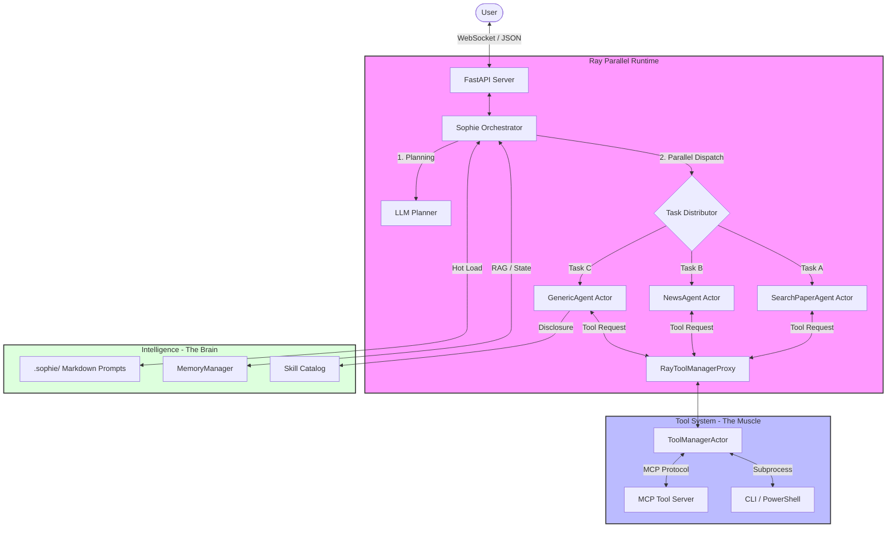

# Sophie AI Assistant (v2.0)

Sophie is a high-performance, enterprise-grade AI assistant system built on a **Microservices & Multi-Agent Architecture**. It leverages **Ray** for parallel task orchestration, **LlamaIndex** for agentic workflows, and the **Model Context Protocol (MCP)** for standardized tool execution.

The system features a clean separation between the "Brain" (LLM reasoning and planning) and the "Muscle" (Tool execution and environment interaction), following a **Prompts-as-Code** philosophy.

---

## 🏗 System Architecture



### Key Architectural Pillars
-   **Ray-Powered Parallelism**: The orchestrator decomposes complex user queries into independent tasks that are executed concurrently across a Ray cluster, significantly reducing latency.
-   **Dual-Track Routing**: 
    -   **Specialized Agents**: High-efficiency workflows for specific domains (Academic Papers, News, Translation).
    -   **Generic Agents**: Dynamic, on-the-fly agents generated for long-tail tasks using **Progressive Tool Disclosure**.
-   **Brain-Muscle Decoupling**: AI logic (Python) is strictly isolated from tool execution (MCP Server). Tools can be written in any language supported by MCP.
-   **Prompts-as-Code**: All system instructions and personas are stored in `.sophie/` as Markdown files, enabling version control and hot-reloading of LLM behavior without code changes.

---

## 🌟 Core Features

-   **Autonomous Planning**: Uses a high-level LLM planner to break down complex goals into a dependency-aware execution graph.
-   **MCP Standardized Tools**: Full support for Model Context Protocol, allowing Sophie to use any MCP-compliant tool server.
-   **Progressive Tool Disclosure**: Instead of overloading the context with all tools, agents dynamically request "Skill Categories," keeping the context window clean and reducing hallucinations.
-   **Hybrid LLM Engine**: Seamlessly switch between local vLLM (for privacy/cost) and OpenRouter (for state-of-the-art reasoning).
-   **Real-time Streaming**: Full WebSocket support for interactive, low-latency communication with the frontend.

---

## 📁 Project Structure

```text
Agents/
├── .sophie/                # Intelligence Layer (Markdown Prompts)
│   ├── agents/             # Personas for Orchestrator and Specialized Agents
│   └── skills/             # Skill catalogs and usage constraints
│
├── agents/                 # Implementation Layer (Workflows)
│   ├── searchpaper_agent.py# Academic paper search (OpenAlex/Semantic Scholar)
│   ├── news_agent.py       # Real-time news analysis & reporting
│   ├── translator_agent.py # High-precision PDF translation workflow
│   └── generic_agent.py    # Dynamic agent for custom tasks
│
├── core/                   # Kernel Layer
│   ├── orchestrator.py     # Parallel task scheduler & Ray manager
│   ├── ray_manager.py      # Ray Actor definitions & Proxy logic
│   ├── tool_manager.py     # Skill category & tool registry
│   ├── mcp_client.py       # MCP protocol implementation
│   └── memory.py           # Context-aware conversation memory
│
├── factorys/               # Abstraction Layer
│   ├── agent_factory.py    # Factory for instantiating Ray Actors/Agents
│   └── model_factory.py    # Unified interface for LLM providers
│
├── sophie-ui/              # Frontend (React + Vite + Tailwind)
│
├── server.py               # Main API Gateway (FastAPI)
├── tools_server.py         # MCP Tool Server (Muscle)
└── config.py               # Environment & System configuration
```

---

## 🚀 Quick Start

### 1. Prerequisites
- Python 3.10+
- Node.js & npm (for UI)
- Ray (installed via pip)

### 2. Environment Setup
Create a `.env` file in the root:
```env
# Intelligence
OPENROUTER_API_KEY=your_key
OPENROUTER_MODEL_NAME=google/gemma-2-9b-it

# Local Muscle (vLLM)
VLLM_API_BASE=http://localhost:8000/v1
DEFAULT_LOCAL_MODEL_PATH=/path/to/your/model
```

### 3. Installation
```bash
pip install -r requirements.txt
cd sophie-ui && npm install && cd ..
```

### 4. Running the System
```bash
# Start the Backend (Automatically starts Ray and Tool Servers)
python server.py

# In another terminal, start the UI
cd sophie-ui
npm run dev
```

---

## 🛠 Extension Guide

### Adding a New Skill
1.  Add a new tool function in `tools_server.py` using `@mcp.tool()`.
2.  Update `.sophie/skills/catalog.md` to include the new tool in a category.
3.  The `GenericAgent` will automatically discover it during execution.

### Creating a Specialized Agent
1.  Inherit from existing agent patterns in `agents/`.
2.  Define a new persona in `.sophie/agents/your_agent.md`.
3.  Register the agent in `factorys/agent_factory.py` and `server.py` registry.

---

## 📄 License
MIT License. Created by Ching-Yang Tien.
